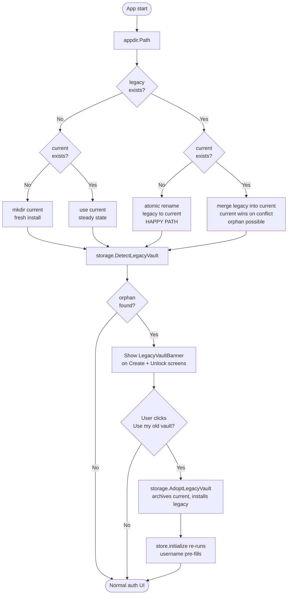
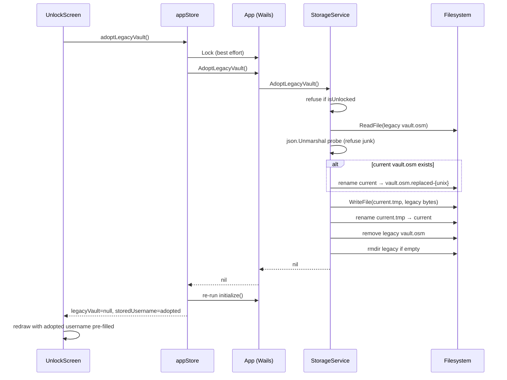
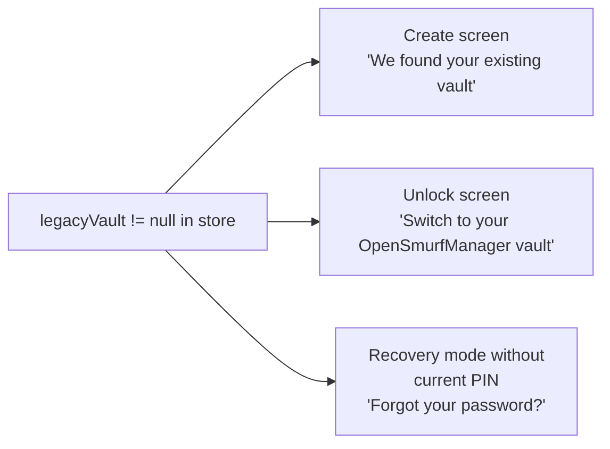

# Data Migrations & Breaking Changes

This document tracks changes to the vault data format and any migrations required.

## Versioning Strategy

- **Vault Version**: Stored in `vault.version` field (currently: 1)
- **App Version**: Set via git tags at build time (e.g., v1.1.0)

### Rules
1. **Additive changes** (new optional fields): No version bump needed, backwards compatible
2. **Structural changes** (renamed/moved fields): Requires vault version bump + migration code
3. **Removed fields**: Requires deprecation notice first, then vault version bump

---

## Vault Version 1 (Initial Release - v1.0.0)

Initial data structure.

### Breaking Changes
None (initial release)

---

## Changes in v1.1.0 (Current Development)

### Added Fields (Non-Breaking)
- `Vault.passwordHint` (string, optional) - Password hint displayed on lock screen

### New Features
- Password change functionality (re-encrypts vault with new credentials)
- Password hint on account creation
- **Update Password Hint** - Legacy users can add/change hint via Settings menu

### Legacy User Support
Users upgrading from v1.0.0:
- Their vault works immediately (no migration needed)
- Can add a hint anytime via **Settings > Update Password Hint**
- Hint will appear on lock screen after they set one

### Migration Required?
**No** - All changes are additive. Old vaults will work without modification.

---

## Future Breaking Change Template

When making breaking changes:

1. Bump `vaultVersion` constant in `storage.go`
2. Add migration function in `storage.go`:
   ```go
   func (s *StorageService) migrateVaultV1ToV2(vault *models.Vault) error {
       // Migration logic here
   }
   ```
3. Call migration in `loadVaultFile()` based on version check
4. Document the change below

---

## Feature Deprecation Process

When removing a feature:

1. **v X.Y.0**: Mark as deprecated in code comments + UI notice
2. **v X.Y+1.0**: Stop using feature, keep data for rollback
3. **v X.Y+2.0**: Safe to remove data/code

### Currently Deprecated Features
None

### Killed Features
None yet

---

## Rollback Strategy

If a user needs to rollback to a previous version:

1. **Data-compatible versions**: Just install old version
2. **After vault version bump**: Keep backup of pre-migration vault file
   - Location: `%APPDATA%\Deckstr\vault.osm.backup.v{N}`

---

## Testing Migrations

Before releasing a version with migrations:
1. Create test with old vault format
2. Verify migration runs correctly
3. Verify data integrity post-migration
4. Test rollback scenario

---

## Directory Migration: OpenSmurfManager → Deckstr

The rebrand renamed `%APPDATA%\OpenSmurfManager` → `%APPDATA%\Deckstr`. The
on-disk file (`vault.osm`) was deliberately NOT renamed: the extension is
not user-facing and renaming it would force a second migration with no UX
benefit.

Three independent layers cooperate to move the user's vault across:

| Layer | Code | When it runs |
| --- | --- | --- |
| Installer | `installer/setup.iss → MigrateLegacyAppData` | Inno Setup `ssPostInstall`, before app launch |
| Runtime resolver | `internal/appdir.Path()` | First `appdir.Path()` call per process (cached via `sync.Once`) |
| UI-driven recovery | `storage.DetectLegacyVault` + `storage.AdoptLegacyVault` | Every `initialize()` and on banner click |

The runtime resolver is the safety net for cases the installer missed
(sideloaded binaries, weird AppData states, partial installs). The
UI-driven recovery is the safety net for the case both layers above
declined to overwrite a real `vault.osm` in the current directory.

### Startup decision flow



### State matrix

What a user lands in for each combination of disk state at app start. "Orphan
risk" = legacy `vault.osm` may be silently abandoned by the resolver's
"current wins" rule and only recoverable via the UI banner.

| Legacy dir | Current dir | Legacy vault.osm | Current vault.osm | Resolver outcome | UI screen | Orphan risk |
| --- | --- | --- | --- | --- | --- | --- |
| ❌ | ❌ | — | — | mkdir current | Create | none |
| ✅ | ❌ | ❌ | — | atomic rename → current empty | Create | none |
| ✅ | ❌ | ✅ | — | atomic rename → vault preserved | Unlock (legacy username pre-filled) | none |
| ❌ | ✅ | — | ❌ | use current as-is | Create | none |
| ❌ | ✅ | — | ✅ | use current as-is | Unlock (current username) | none |
| ✅ | ✅ | ✅ | ❌ | per-entry merge → vault moved into current | Unlock (legacy username) | none |
| ✅ | ✅ | ❌ | ✅ | merge no-op | Unlock (current username) | none |
| ✅ | ✅ | ✅ | ✅ | **current wins, legacy orphaned** | Unlock (current username) **+ banner** | mitigated by banner |

### Adoption sequence (banner click)



### Recovery surfaces

The legacy banner appears wherever the user might be confused about why
they can't see their data:



The "Forgot your password?" link itself is **always visible** on the
unlock screen — gating it on `hasRecoveryPhrase` or three failed attempts
hid the recovery path from users who needed it most.

### Failure modes & invariants

The detection and adoption code is covered by
`internal/storage/storage_legacy_test.go`. Key invariants:

- **Detection is side-effect-free.** Probing on every `initialize()` is fine.
- **Adoption refuses while unlocked.** Prevents the in-memory state from
  disagreeing with newly-installed on-disk bytes.
- **Adoption never silently destroys data.** Existing `current/vault.osm`
  is renamed to `vault.osm.replaced-<unix>` before the legacy bytes are
  installed.
- **Adoption refuses junk.** Legacy file is `json.Unmarshal`-probed before
  the current vault is touched. A corrupt legacy file leaves the current
  vault intact.
- **Cleanup is best-effort.** After successful adoption the legacy file
  and (if empty) its directory are removed so the banner doesn't keep
  appearing — but a failed cleanup doesn't fail the adoption.

### Manual recovery path

If the in-app banner ever fails (corruption, permissions), the user can
recover manually:

1. Close Deckstr.
2. Move `%APPDATA%\OpenSmurfManager\vault.osm` to `%APPDATA%\Deckstr\vault.osm`,
   archiving any existing file there first as `vault.osm.replaced-manual`.
3. Relaunch Deckstr.

The atomic rename in step 2 is the same operation `AdoptLegacyVault`
performs internally.
