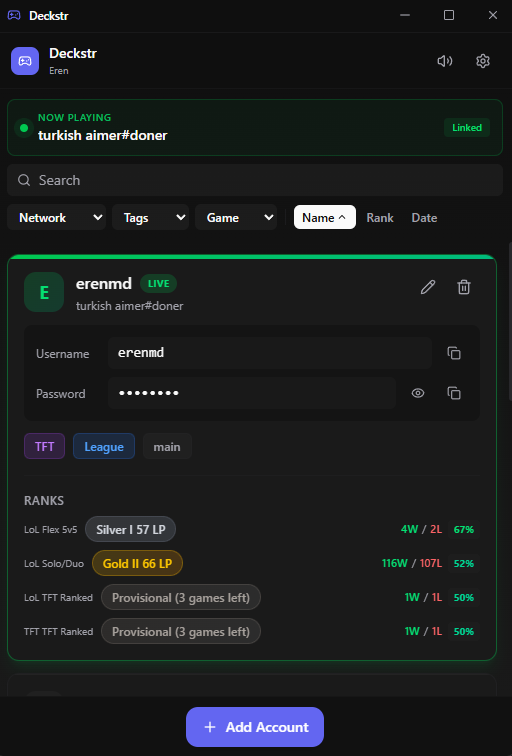

# Deckstr

<div align="center">

**The secure, local-first account manager for gamers**

[](https://github.com/ajanitshimanga/Deckstr/releases)
[](https://github.com/ajanitshimanga/Deckstr/releases)
[](LICENSE)
[](https://github.com/ajanitshimanga/Deckstr/releases)

<br />

[](https://github.com/ajanitshimanga/Deckstr/releases/latest)

[Features](#features) · [Roadmap](#roadmap) · [Contributing](#contributing)

</div>

---

## Why Deckstr?

Managing multiple gaming accounts is a pain. Spreadsheets leak, browser passwords sync to clouds you don't control, and sticky notes... well, you know.

**Deckstr** keeps your credentials **encrypted locally** on your machine. No cloud. No sync. No data leaving your computer. Just military-grade encryption protecting your accounts.

### Built by a Competitive Player

> *"Previously, I peaked Top 500 in Overwatch, Top 1000 in Valorant, Eternity in Marvel Rivals, and multi-season Grand Champion in Rocket League. I have accounts at every rank because that's the only way to actually play with all my friends. I got tired of spreadsheets."*
>
> *Next goal: Challenger in TFT. If you're curious, come hang out.*

This isn't about stomping lower-ranked lobbies—it's about being able to queue with friends at different skill levels without a 3-division gap locking you out. If you've ever had to remember which account has which rank, which champions, or which region, this tool is for you.

### Built for Riot Games Players

- **Auto-detect** your signed-in Riot account
- **Track ranks** across League of Legends and TFT
- **See champion masteries** at a glance
- **One-click copy** credentials when switching accounts

---

## Features

### Security First

| Feature | Description |
|---------|-------------|
| **AES-256-GCM Encryption** | Bank-level encryption for all stored data |
| **Argon2id Key Derivation** | OWASP-recommended password hashing |
| **Zero-Knowledge** | Your master password never leaves your device |
| **Local Storage Only** | No cloud, no sync, no data collection |
| **Password Hints** | Optional hints to help remember your master password |

### Account Management

- **Unlimited accounts** - Store as many as you need
- **Tag system** - Organize with labels like "main", "alt", "ranked-only"
- **Quick copy** - One-click copy username or password
- **Notes field** - Add reminders for each account
- **Search & filter** - Find accounts instantly

### Riot Games Integration

- **Live Detection** - Automatically detects which account is signed in
- **Rank Tracking** - Caches Solo/Duo, Flex, and TFT ranks
- **Champion Mastery** - Shows your top 3 champions per account
- **BYOK Support** - Use your own Riot API key for offline rank lookups

### Quality of Life

- **Auto-updater** - Get new features automatically
- **Compact UI** - Clean, modern interface that stays out of your way
- **Password change** - Update your master password anytime
- **Dark mode** - Easy on the eyes for late-night sessions

---

## Installation

### Quick Start (Windows)

1. Download the latest installer from [Releases](https://github.com/ajanitshimanga/Deckstr/releases)
2. Run `Deckstr-Setup-x.x.x.exe`
3. Create your account with a strong master password
4. Start adding your gaming accounts!

### System Requirements

- Windows 10/11 (64-bit)
- ~50MB disk space
- No internet required (except for rank fetching and updates)

---

## Screenshots

<p align="center">
  
</p>

<p align="center">
  <em>Track ranks across LoL, TFT, and more. One-click copy credentials. Auto-detect your signed-in account.</em>
</p>

---

## Roadmap

### Coming Soon (Low-Hanging Fruit)

These features are planned and relatively easy to implement:

| Feature | Status | Description |
|---------|--------|-------------|
| **Valorant Ranks** | Planned | Track competitive ranks for Valorant |
| **Export/Import** | Planned | Backup and restore your accounts |
| **Keyboard Shortcuts** | Planned | Quick-copy with Ctrl+C style shortcuts |
| **Account Sorting** | Planned | Sort by rank, last played, or custom order |
| **Region Selector** | Planned | Per-account region settings for API calls |

### Future Ideas

- **macOS & Linux** support
- **Cloud sync** (optional, encrypted)
- **Auto-login** integration with Riot Client
- **Steam/Epic** account support
- **2FA backup codes** storage
- **Account sharing** (encrypted exports for trusted friends)

### Want to Suggest a Feature?

[Open an issue](https://github.com/ajanitshimanga/Deckstr/issues) with the `enhancement` label!

---

## Security

### How Your Data is Protected

```
Master Password
      │
      ▼
┌─────────────────┐
│  Argon2id KDF   │  ← Slow hash, defeats brute force
│  (64MB memory)  │
└────────┬────────┘
         │
         ▼
┌─────────────────┐
│  AES-256-GCM    │  ← Authenticated encryption
│  (random nonce) │
└────────┬────────┘
         │
         ▼
┌─────────────────┐
│   vault.osm     │  ← Encrypted file on your disk
└─────────────────┘
```

### What's Stored in Plain Text?

Only metadata needed for the login screen:
- Your username (for pre-filling)
- Password hint (if you set one)
- Timestamps

**All account credentials are encrypted.**

### Reporting Security Issues

Please email security concerns privately. Do not open public issues for vulnerabilities.

---

## Development

### Prerequisites

- Go 1.21+
- Node.js 20+
- [Wails CLI](https://wails.io/docs/gettingstarted/installation)

### Running Locally

```bash
# Clone the repo
git clone https://github.com/ajanitshimanga/Deckstr.git
cd Deckstr

# Install frontend dependencies
cd frontend && npm install && cd ..

# Run in development mode
wails dev
```

### Building

```bash
# Build production executable
wails build

# Build with installer (Windows)
# See .github/workflows/release.yml
```

### Testing

```bash
# Run all tests
go test ./...

# Run specific package tests
go test ./internal/storage -v
go test ./internal/crypto -v
```

### Project Structure

```
Deckstr/
├── frontend/           # React + TypeScript UI
│   ├── src/
│   │   ├── components/ # UI components
│   │   ├── stores/     # Zustand state management
│   │   └── lib/        # Utilities
├── internal/           # Go backend
│   ├── crypto/         # Encryption (AES-256-GCM, Argon2id)
│   ├── storage/        # Vault management
│   ├── models/         # Data structures
│   ├── riotclient/     # LCU integration
│   ├── riotapi/        # Riot API client
│   └── updater/        # Auto-update system
├── app.go              # Wails bindings
├── DEVELOPMENT.md      # Development guide
└── MIGRATIONS.md       # Data migration tracking
```

---

## Contributing

Contributions are welcome! Please read the [Development Guide](DEVELOPMENT.md) first.

### Quick Contribution Guide

1. Fork the repository
2. Create a feature branch (`git checkout -b feature/amazing-feature`)
3. Write tests for your changes
4. Ensure all tests pass (`go test ./...`)
5. Commit your changes
6. Push to your fork
7. Open a Pull Request

---

## FAQ

<details>
<summary><strong>Is my data safe?</strong></summary>

Yes. Your data is encrypted with AES-256-GCM and never leaves your computer. Even if someone gets your vault file, they cannot read it without your master password.
</details>

<details>
<summary><strong>What if I forget my master password?</strong></summary>

Unfortunately, there's no recovery option—that's the security tradeoff. We recommend:
- Setting a password hint when creating your account
- Using a memorable but strong password
- Keeping a secure backup of your password
</details>

<details>
<summary><strong>Does this work with Valorant?</strong></summary>

Account storage works with any game. Automatic rank tracking for Valorant is on the roadmap.
</details>

<details>
<summary><strong>Is this against Riot's Terms of Service?</strong></summary>

Deckstr is a local password manager. It does not automate gameplay, inject into the client, or provide any competitive advantage. It simply stores your credentials securely, like any password manager.
</details>

<details>
<summary><strong>Can I sync across computers?</strong></summary>

Not yet. The vault file is at `%APPDATA%\Deckstr\vault.osm` (legacy installs were at `%APPDATA%\OpenSmurfManager\` — auto-migrated on first launch after rebrand) — you could manually copy it, but we recommend against it for security reasons. Encrypted cloud sync is on the future roadmap.
</details>

---

## Support the Project

If Deckstr saves you time, consider supporting development:

<p align="center">
  <a href="https://github.com/sponsors/ajanitshimanga">
    
  </a>
</p>

Your support helps fund:
- New features (Valorant rank tracking, cloud sync, and more)
- Bug fixes and security updates
- Keeping the core app free forever

---

## License

MIT License - see [LICENSE](LICENSE) for details.

---

<div align="center">

**Made with security in mind**

[Report Bug](https://github.com/ajanitshimanga/Deckstr/issues) · [Request Feature](https://github.com/ajanitshimanga/Deckstr/issues) · [Sponsor](https://github.com/sponsors/ajanitshimanga)

</div>
